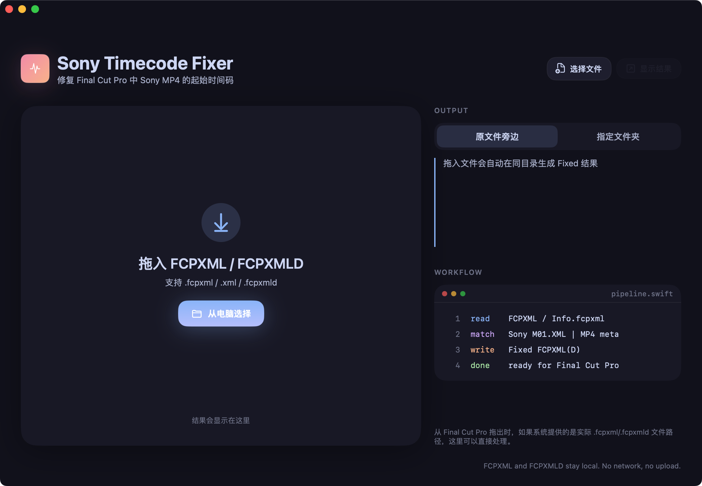

# Sony Timecode Fixer

如果你在 Final Cut Pro 里剪过 Sony FX 系列、A7S 系列拍的素材, 大概率撞过这个老问题: 从 FCP 导出 XML 之后, Sony MP4 的起始时间码丢了, 拿到 DaVinci Resolve 一看全是 `00:00:00:00`, 跟现场 DIT 表对不上, 跟原始素材 metadata 也对不上, 调色师过来问你怎么回事。

这件事在 [CommandPost](https://commandpost.io/) 里多年前就有解决方案——他们的 Final Cut Pro Sony Timecode Toolbox 把这套修复逻辑写得很完整。但 CommandPost 是一整套庞大的 Hammerspoon 扩展, 为了用其中一个小功能要装一堆东西, 对很多人来说门槛偏高。

所以这个项目做的事情很简单: **把上游那段 Sony 时间码修复逻辑抠出来, 包成一个独立的 macOS app**。拖一个 `.fcpxml` 或 `.fcpxmld` 进去, 几秒钟拿到一个 Fixed 版本, 再扔回 FCP 或者 DaVinci 都行。

文件完全本地处理, 不联网, 不上传。

> English README: [README.en.md](README.en.md)

## Screenshots



## 它能修什么

- `.fcpxml` 单文件
- `.fcpxmld` 软件包(FCP 导出的 XML Bundle, 多 clip 项目常见)
- 同时支持 Sony 边车 `M01.XML` 和 MP4 尾部内嵌 metadata 两种来源
- 输出文件自动带 `- Fixed` 后缀, 不会覆盖你的原始 XML

## 它不能做什么

- 不修非 Sony 摄像机的素材。本项目专门处理 Sony 的 metadata 格式, ARRI、RED、Canon 这些请用别的工具。

## 安装

### 普通用户

去 [Releases](https://github.com/haixing23/sony-timecode-fixer/releases) 下载最新的 `.dmg`, 双击挂载, 把 app 拖进 Applications。

⚠️ **第一次启动必须右键打开**。因为这是个人开源项目, 没有走 Apple 公证(那需要 99 美元/年的 Developer 账号), 直接双击会被 Gatekeeper 拦下来。处理方式两种:

**方式 A**: Finder 里右键 app → 打开 → 弹窗里再点"打开"。之后就能正常双击启动了。

**方式 B**: 终端跑一下:

```bash
xattr -cr /Applications/SonyTimecodeFixer.app
```

这条命令会移除下载文件的隔离属性, 之后双击启动即可。

### Homebrew

如果你习惯用 Homebrew:

```bash
brew tap haixing23/tap
brew install --cask sony-timecode-fixer
```

Homebrew Cask 会自动处理隔离属性, 装完直接双击启动, 不需要右键。

## 用法

1. FCP 里选中你的项目, **File → Export XML...**, 选 `.fcpxml` 或 `.fcpxml Bundle`。
2. 打开 Sony Timecode Fixer。
3. 把导出的 XML 拖进窗口, 或者拖到 dock 上的 app 图标。
4. 选输出位置(默认就放在原文件旁边)。
5. 几秒钟后拿到一个 `项目名 - Fixed.fcpxml` 或 `项目名 - Fixed.fcpxmld`。
6. 把这个 Fixed 文件导回 FCP(File → Import → XML), 或者直接给 DaVinci / Premiere。

## 从源码编译

```bash
make build
```

产物在:

```text
build/Build/Products/Release/SonyTimecodeFixer.app
```

打包 `.dmg`:

```bash
make dmg
```

发布前完整封装测试:

```bash
make package-test
```

`package-test` 会生成 DMG、挂载 DMG、检查 `.app` 和 `Applications` 软链、验证 ad-hoc 签名、复制到临时目录模拟安装, 并启动 app 5 秒确认不崩。

### 编译需要

- macOS 14 (Sonoma) 或更新
- Apple Silicon Mac
- Xcode Command Line Tools
- `/usr/bin/python3`(macOS 自带, 不用单独装)

## 项目结构

```text
Sources/SonyTimecodeFixerApp/       SwiftUI 界面层
Resources/                          plist 和 Python 转换核心
Assets/                             图标 SVG 源、生成的 .icns、截图
Examples/                           最小化的 FCPXML / FCPXMLD 测试样本
scripts/                            build、dmg、smoke-test、封装测试脚本
ThirdParty/CommandPostSonySource/   上游参考代码快照
build/                              Release app 构建输出, 已 gitignore
dist/                               DMG 输出, 已 gitignore
```

界面是 SwiftUI 写的, 但真正干活的是一段 Python 脚本(从 CommandPost 的 Lua 实现移植过来)。SwiftUI 层只负责 UI、拖放交互和调度。

## 测试

```bash
make test
```

测试覆盖 FCPXML / FCPXMLD 解析、Sony M01.XML 匹配、时间码计算。`Examples/` 下有一组最小化样本, 能跑通整个流程。

快速验证 app 能启动:

```bash
make smoke
```

发布前验证 DMG 封装:

```bash
make package-test
```

## 致谢

老实讲, 这个项目主要是给 [CommandPost](https://commandpost.io/) 的 Sony Timecode Toolbox 做了个独立的 Mac App 壳。真正的核心——读 Sony M01.XML、解析 MP4 尾部 metadata、计算正确时间码、写回 FCPXML 这一整套逻辑——是 CommandPost 团队多年前就写好的。

具体参考的是他们 repo 里的这个模块:

https://github.com/CommandPost/CommandPost/tree/develop/src/plugins/finalcutpro/toolbox/sonytimecode

CommandPost 在 MIT 协议下开源, 完整版权信息见 `NOTICE`。

如果你觉得这个工具有用, 也请去给 [CommandPost](https://github.com/CommandPost/CommandPost) 一个 star——他们才是上游, 这边只是顺手做了个更轻量的入口。

## License

MIT。详见 `LICENSE`。
